# Context Generation Context Management (CGCM) 2.0

An intelligent **Context Management System** designed to analyze and maintain deep contextual understanding of large-scale codebases (300+ files). Built for autonomous developer systems, CGCM provides structured, up-to-date context for downstream AI tasks such as code modification, refactoring, and feature implementation.

## Table of Contents

- [Overview](#overview)
- [Architecture](#architecture)
- [Features](#features)
- [Tech Stack](#tech-stack)
- [Prerequisites](#prerequisites)
- [Quick Start](#quick-start)
- [Configuration](#configuration)
- [Usage](#usage)
- [System Architecture](#system-architecture)


## Overview

CGCM 2.0 addresses the critical challenge of maintaining contextual awareness in large, evolving codebases. Unlike traditional documentation tools, this system is designed for **machine-to-machine collaboration**, providing AI systems with the structured context they need to perform complex code operations.

### Problem Solved
- **Context Fragmentation**: Large codebases become difficult to understand and navigate
- **Change Tracking**: Manual detection of code changes across hundreds of files
- **AI Integration**: Lack of structured context for autonomous development tools
- **Multi-language Support**: Managing context across Python, JavaScript, and TypeScript projects

### Key Differentiators
- **Real-time Change Detection**: Uses merkle tree algorithms to efficiently detect file modifications  
- **Multi-modal Context Sources**: Combines RAG retrieval, graph databases, and grep search
- **Incremental Updates**: Only processes changed components, ensuring scalability


## Architecture

CGCM 2.0 follows a **4-layer architecture** pattern:

```
Routes → Controllers → Use Cases → Services
```


## Features

### Context Gathering
- **Automatic Change Detection**: Monitors codebase using merkle tree hashing
- **Smart Chunking**: Processes only modified files to maintain efficiency  
- **Repository Mapping**: Creates comprehensive graph representations in Neo4j
- **Vector Embeddings**: Generates contextual embeddings for semantic search

### Query & Retrieval
- **Multi-source Context**: Combines graph queries, vector search, and text pattern matching
- **LLM-Generated Queries**: Automatically creates Cypher queries based on user intent
- **Fallback Mechanisms**: Ensures reliable results through layered search strategies
- **Real-time Processing**: Provides immediate context for development workflows

### User Interface
- **React-based frontend** - Streamlined UI for context visualization
- **Background Polling**: Real-time polling for codebase changes
- **Chat Interface**: Interactive query interface


## Prerequisites

Before installing CGCM 2.0, ensure you have the following installed:

### Required Software
- **Python 3.8+** with pip
- **Node.js 16+** with npm
- **Docker Desktop** (for database services)
- **Git** for repository cloning

### Development Tools
- **uv** (Python package manager) - Install via `curl -LsSf https://astral.sh/uv/install.sh | sh`


## Tech Stack

### Backend
- **FastAPI** - High-performance async Python web framework
- **Python 3.8+** - Core application logic
- **Uvicorn** - ASGI server for production deployment

### Frontend  
- **React** - Modern UI component library
- **Vite** - Fast build tool and dev server
- **Node.js** - JavaScript runtime environment

### Databases
- **MongoDB** - Document storage for chunked code data
- **Neo4j** - Graph database for repository relationships  
- **Pinecone** - Vector database for semantic search

### AI & Processing
- **Voyage AI** - Advanced embedding generation
- **Chonkie** - Intelligent code chunking library

### Infrastructure
- **Docker & Docker Compose** - Containerized deployment
- **uv** - Fast Python package management

## Quick Start

Get CGCM 2.0 running in under 5 minutes:

```bash
# Clone the repository
git clone https://github.com/vaghani04/CGCM_2_0.git
cd CGCM_2_0

# Start neo4j database service  
docker-compose up -d

# Setup Python environment
uv venv
source .venv/bin/activate
uv pip install -r requirements.txt

# Start the backend
uvicorn src.main:app --reload

# In a new terminal, setup frontend
cd frontend
npm install
npm run dev
```

Access the application at `http://localhost:5173`

## Configuration

### Environment Variables

Create a `.env` file in the project root:

```env
OPENAI_API_KEY=sk-xxxxxxxxxxxxxx
PINECONE_API_KEY=psc-xxxxxxxxxxxxxxx
VOYAGEAI_API_KEY=pa-xxxxxxxxxxxxx
```


## Usage

### 1. Context Gathering (Preprocessing)

Before querying your codebase, initialize the context gathering system:

```bash
# Make a POST request to gather context from your codebase
curl -X POST "http://localhost:8000/api/v1/context-gather" \
  -H "Content-Type: application/json" \
  -d '{"codebase_path": "/path/to/your/project"}'
```

This process:
- Scans the codebase for Python/JavaScript/TypeScript files
- Creates chunks and generates embeddings  
- Builds repository graph in Neo4j
- Stores processed data for querying

### 2. Querying Context

Once preprocessing is complete, query your codebase:

```bash
# Query the context system
curl --location 'http://localhost:8000/api/v1/user-query' \
--header 'Content-Type: application/json' \
--data '{
  "query": "query to retrieve the context",
  "codebase_path": "/path/to/your/project"
}
'
```

### 3. Web Interface

Navigate to `http://localhost:5173` to use the web interface:

1. **Setup Phase**: Enter your codebase path to begin context gathering
2. **Query Phase**: Ask questions about your codebase structure and functionality
3. **Monitoring**: The system automatically polls for changes every 3 minutes


## System Architecture



### Data Flow

1. **Preprocessing**: Codebase → Change Detection → Chunking → Embeddings → Storage
2. **Query Processing**: User Query → Multi-source Retrieval → Context Assembly → Response
3. **Continuous Monitoring**: Background polling → Change Detection → Incremental Updates

---

<div align="right">
<strong>Built with ❤️ by Maunik Vaghani</strong>
</div>